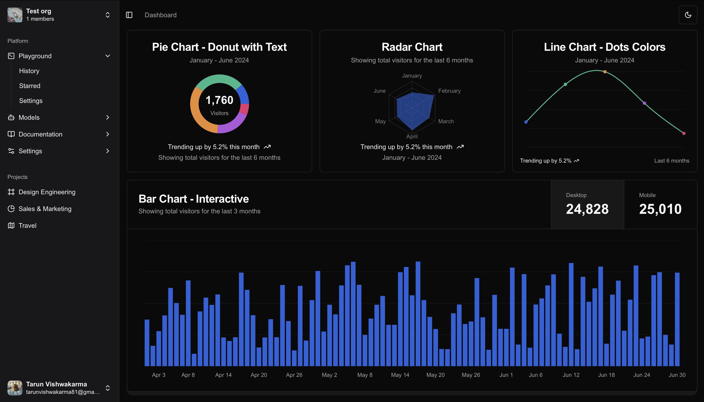

# Dashboard-App



live demo - https://dashboard-app-mu-drab.vercel.app/dashboard

## Overview
Dashboard-App is an interactive and customizable dashboard built using **Next.js**. It allows users to create multiple organizations and visualize data in an engaging and interactive format. The application fetches data from an external API and incorporates **Clerk** for authentication and API creation.

---

## Features

- **Multi-Organization Support**: Users can create and manage multiple organizations.
- **Data Visualization**: Supports various chart types, including Pie Charts, Radar Charts, Line Charts, and Bar Charts.
- **Interactive UI**: Users can interact with the dashboard to view data trends.
- **Authentication**: Uses **Clerk** for authentication and API security.
- **Custom Branding**: Organizations can upload and customize logos.
- **API Integration**: Fetches data from an external server for real-time insights.
- **Dark Mode Support**: A modern dark theme for improved user experience.
- **User Roles & Permissions**: Allows admins to manage access levels for team members.

---

## Tech Stack

- **Frontend**: Next.js, Tailwind CSS
- **Authentication**: Clerk
- **Backend**: External API integration
- **Charts & Graphs**: Chart.js / Recharts (or other libraries based on implementation)

---

## Installation

### Prerequisites
Ensure you have the following installed:
- **Node.js** (v16 or later)
- **Yarn** or **npm**

### Steps
1. Clone the repository:
   ```sh
   git clone https://github.com/your-repo/Dashboard-App.git
   cd Dashboard-App
   ```
2. Install dependencies:
   ```sh
   npm install
   # or
   yarn install
   ```
3. Set up environment variables:
   Create a `.env.local` file and add the following:
   ```env
   NEXT_PUBLIC_CLERK_FRONTEND_API=<your_clerk_api_key>
   NEXT_PUBLIC_BACKEND_API=<your_backend_api_url>
   ```
4. Start the development server:
   ```sh
   npm run dev
   # or
   yarn dev
   ```

---

## Usage
- Log in using **Clerk authentication**.
- Create a new **organization** and upload a custom logo.
- View various **interactive charts** displaying data.
- Manage **team roles and permissions**.
- Customize the dashboard with different **themes and settings**.

---

## Deployment
You can deploy the app using **Vercel** or **Netlify**.

### Deploying on Vercel
1. Install Vercel CLI:
   ```sh
   npm install -g vercel
   ```
2. Run the deployment command:
   ```sh
   vercel
   ```
3. Follow the prompts to complete the deployment.

---

## Contribution
We welcome contributions! Follow these steps:
1. Fork the repository.
2. Create a new branch:
   ```sh
   git checkout -b feature-branch
   ```
3. Commit changes and push to your fork.
4. Open a Pull Request.

---

## License
This project is licensed under the **MIT License**.

---

## Contact
For any queries or issues, feel free to reach out at **your-email@example.com** or open an issue in the repository.

